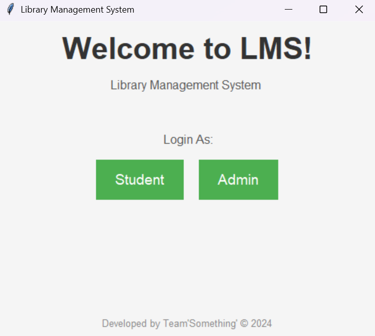
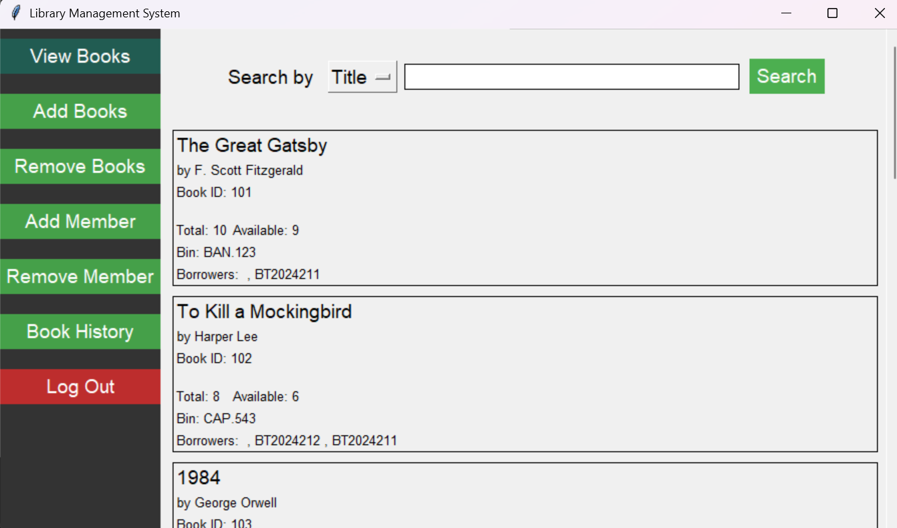
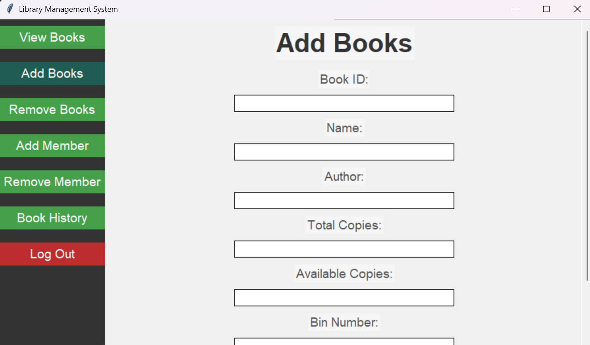
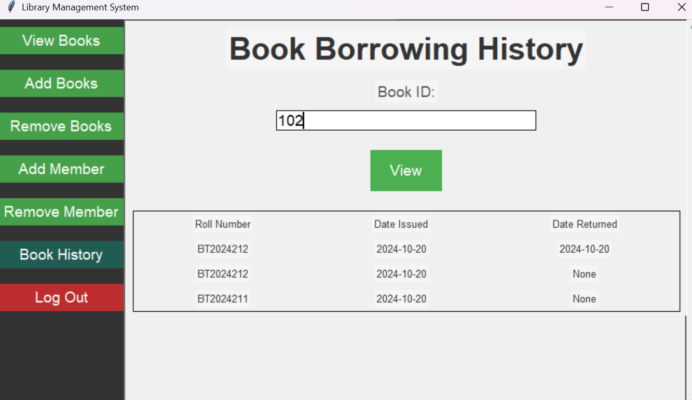

Library Management System (LMS)
-------------------------------

## How to run and use this application
1. Run the **`main.py`** file by entering **`python3 main.py`**. Make sure that the current directory is correct.
2. To login to the **Admin** page, enter the following details: **Username**: `admin` and **Password**: `123`.
3. No other files need to be handled.
4. The terminal will show output for debugging purposes. It may be ignored.
5. A single window of size `500 x 420` will open. The window will automatically resize itself as needed. However, it may be enlarged manually.
6. The entire application will run in a single window only.
7. Only manual scrolling via the scrollbars is supported.
8. The `Enter` key is _not_ supported for submitting input and/or clicking any buttons.

## GitHub Repository

